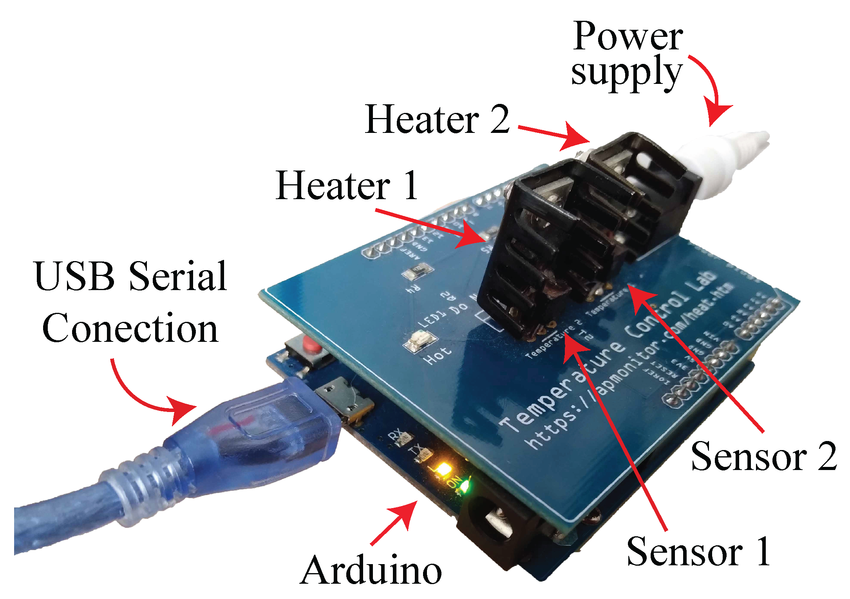

# Indice

- [Installazione](#1-installazione)
- [Struttura del repository](#2-struttura-del-repository)
- [Concetti di base del pacchetto](#3-concetti-di-base-del-pacchetto)
- [Esempi](#4-gli-esempi-example_open_looppy-e-example_proportionalpy)
- [Guida allo sviluppo del progetto](#5-guida-al-progetto-degli-studenti)
- [Suggeimenti per la relazione](#6-suggerimenti-per-la-relazione-finale)

# lsi_tcp – Laboratorio di Controllo con il Temperature Control Lab

Questo repository fornisce un piccolo framework Python per svolgere 
le esercitazioni di **controllo di processo** con il banco didattico
**Temperature Control Lab (TCLab)**.

L’obiettivo principale è supportare il progetto degli studenti che prevede tre fasi:

1. **Prova di identificazione** del sistema (anello aperto);
2. **Modellazione FOPDT** (First Order Plus Dead Time) a partire dai dati salvati nei CSV per entrambi i sistemi;
3. **Taratura di due anelli di controllo** (tipicamente sulle temperature T1 e T2) e validazione in anello chiuso.

Il pacchetto espone:

- classi per gestire il banco reale (`TCLabSystem`) e un modello simulato (`FakeTCLabSystem`);
- una gerarchia di controllori SISO (`BaseController`, `PController`, `ManualController`);
- una dashboard web (Dash/Plotly) per il monitoraggio e il tuning in tempo reale;
- utilità per gestire profili di setpoint e per orchestrare il loop di controllo.

---

## 1. Installazione

### 1.1. Programmi da installare 

In Windows,
- [Git](https://git-scm.com/install/windows)
- [Anaconda](https://repo.anaconda.com/archive/Anaconda3-2025.06-0-Linux-x86_64.sh) 

In Ubuntu, aprire il terminale e copiare questo comando
```bash
sudo apt install git python3.12
```

### 1.2. Clonare / installare il pacchetto

Installazione diretta da GitHub:

In Windows aprire `anaconda power shell` e copiare questo comando
```bash
pip install "git+https://github.com/JRL-CARI-CNR-UNIBS/lsi_tcp.git#master"
```

In Ubuntu, aprire il terminale e copiare questo comando
```bash
pip install "git+https://github.com/JRL-CARI-CNR-UNIBS/lsi_tcp.git#master"
```

> **Nota**: il pacchetto è pensato per Python ≥ 3.11 .


### 1.3. Connessione
La connessione del dispositivo è descritta nella foto

e a questo [link](https://jckantor.github.io/cbe30338-book/tclab/00.01-setting-up-tclab.html).

> [!WARNING]  
> Gli heater possono essere molto caldi, non toccateli!
---

## 2. Struttura del repository

All’interno dello zip / repo troverete indicativamente:

```text
tclab/
├── example_open_loop.py
├── example_proportional.py
├── lsi_tcp/
│   ├── __init__.py
│   ├── tclab_system.py
│   ├── base_controller.py
│   ├── proportional_controller.py
│   ├── manual_controller.py
│   ├── channel_runtime.py
│   ├── dashboard_state.py
│   ├── controllers_dashboard.py
│   ├── setpoint_profile.py
│   ├── utils.py
│   ├── taratura.md
│   ├── Antiwindup.md
│   └── example.csv
├── pyproject.toml
├── requirements.txt
└── README.md   ← questo file
```

I file più importanti per il progetto sono:

- `example_open_loop.py`  
  Esempio di struttura di script per prove in **anello aperto** (identificazione) e logging su CSV.

- `example_proportional.py`  
  Esempio di struttura di script per controllo **proporzionale** in **anello chiuso**.

- `lsi_tcp/tclab_system.py`  
  Implementa:
  - `BaseTCLabSystem` (classe astratta);
  - `TCLabSystem` (hardware reale);
  - `FakeTCLabSystem` (simulatore).

- `lsi_tcp/base_controller.py`, `proportional_controller.py`, `manual_controller.py`  
  Gerarchia di controllori SISO.

- `lsi_tcp/channel_runtime.py` + `lsi_tcp/dashboard_state.py`  
  Coordinano, per ciascun canale, i due controllori sempre istanziati
  (`ManualController` + il vostro controllore automatico) e lo stato
  condiviso con la dashboard (modalità manuale/automatico, potenza manuale,
  setpoint). Non richiedono modifiche da parte vostra: sono usati
  internamente da `utils.build_channels`.

- `lsi_tcp/controllers_dashboard.py`  
  Dashboard Dash per il tuning dei controllori e il monitoraggio dei segnali.

- `lsi_tcp/setpoint_profile.py` + `lsi_tcp/example.csv`  
  Gestione di profili di setpoint letti da CSV (T1 e T2).

- `lsi_tcp/utils.py`  
  Utility di alto livello (`build_process`, `build_setpoint_profile`,
  `build_channels`, `init_channels`, `run_closed_loop`) usate negli esempi.

---

## 3. Concetti di base del pacchetto

### 3.1. Sistemi TCLab: `TCLabSystem` e `FakeTCLabSystem`

Nel modulo `tclab_system.py` la classe astratta **`BaseTCLabSystem`** definisce il comportamento comune:

- gestione del thread di acquisizione;
- lettura delle variabili di processo;
- scrittura dei comandi agli attuatori;
- logging su file CSV;
- (opzionale) interfaccia con dashboard in tempo reale.

Le implementazioni concrete sono:

- `TCLabSystem(BaseTCLabSystem)`  
  Usa il pacchetto `tclab` e comunica con la board reale.

- `FakeTCLabSystem(BaseTCLabSystem)`  
  Utilizza un **modello matematico** tipo FOPDT per simulare:

  - canale T1 ↔ U1 con parametri (K1, τ1, L1);
  - canale T2 ↔ U2 con parametri (K2, τ2, L2).

  L’equazione è:

  $$ 
\frac{T}{U}=\frac{K}{\tau s+1}e^{-sL}
  $$

  Il tempo di ritardo L è implementato con una coda in funzione del `log_interval`.

#### Costruttori tipici

- Per l’hardware reale:

  ```python
  from lsi_tcp import TCLabSystem

  process = TCLabSystem(
      log_flag=True,
      log_interval=1.0,   # [s] fra due campioni loggati
      plot_period=1.0,    # [s] fra due aggiornamenti dei grafici interni
      time_window=3000,   # [s] finestra storia grafici
  )
  ```

- Per il simulatore:

  ```python
  from lsi_tcp import FakeTCLabSystem

  process = FakeTCLabSystem(
      log_flag=True,
      log_interval=1.0,
      plot_period=1.0,
      time_window=3000,
      realtime_factor=10.0,  # sim 10 volte più veloce del tempo reale
  )
  ```

#### Metodi essenziali

- `readProcessVariables() -> (T1, T2)`  
  Legge le temperature attuali (in °C).

- `writeControlCommands(u1, u2)`  
  Scrive le potenze (0–100%) sui due heater.

- `stop()`  
  Ferma l’acquisizione e chiude il file di log.

#### File di log CSV

Quando `log_flag=True`, viene creato un file tipo:

```text
tclab_YYYYMMDDHHMMSS.csv
```

con intestazione:

```text
Time, T1, T2, U1, U2
```

- **Time**: timestamp *simulato* (derivato da `_get_sim_time()`), scalato da `realtime_factor`;
- **T1, T2**: temperature [°C];
- **U1, U2**: comandi in [%].

Per l’identificazione FOPDT userete proprio questi CSV.

---

### 3.2. Controllori SISO

Nel modulo `base_controller.py` è definita la classe astratta **`BaseController`**, che stabilisce l’interfaccia comune:

- `computeControlAction(reference, measure, feedforward) -> float`
- `starting(reference, measure, initial_u, feedforward) -> None`
- `getListOfParameters() -> List[str]`
- `setParameters(params: Dict[str, Any]) -> None`
- `getParameters() -> Dict[str, Any]`

Inoltre gestisce centralmente:

- saturazione dell’azione di controllo (`u_min`, `u_max`);
- mappatura parametri ↔ attributi della classe.

#### 3.2.1. `PController`

Definito in `proportional_controller.py`:

```python
from lsi_tcp import PController

c = PController(
    sampling_period=1.0,
    Kp=1.0,
    u_min=0.0,
    u_max=100.0,
)
```

Implementa:

- errore: `e = reference - measure`;
- azione: `u = Kp * e + feedforward`;
- saturazione con `u_min`/`u_max`.

I parametri esposti (tipici) sono:

- `Kp` (guadagno proporzionale),
- eventuali limiti `u_min`, `u_max`.

È il controllore da cui partire (in un file diverso nella vostra cartella) per l'implementazione
del controllore PID.

#### 3.2.2. `ManualController`

Definito in `manual_controller.py`, è un controllore puramente manuale:

```python
from lsi_tcp import ManualController

c = ManualController(
    sampling_period=1.0,
    manual_control_action=0.0,  # valore di U [%]
    u_min=0.0,
    u_max=100.0,
)
```

- l’azione di controllo è semplicemente:

  ```python
  u = manual_control_action
  ```

  indipendentemente da `reference`, `measure`, `feedforward`;

- è utile per:
  - prove in **anello aperto** (identificazione);
  - confronti con il comportamento in automatico;
  - il jog manuale dalla dashboard: **ogni canale ha sempre, contemporaneamente,
    un `ManualController` e il vostro controllore automatico** (vedi §3.3 e
    §3.5); un flag per canale decide quale dei due calcola `u` in un dato
    istante, con bumpless transfer al cambio di modalità.

---

### 3.3. Dashboard dei controllori

Nel modulo `controllers_dashboard.py` c’è la classe **`ControllerDashboard`**, che crea una web app Dash/Plotly per:

- visualizzare nel tempo `T1`, `T2`, `U1`, `U2` ed eventuali setpoint `SP1`, `SP2`;
- passare da manuale ad automatico (e viceversa) **per canale**, con uno switch;
- un campo numerico "adattivo" per canale: in manuale imposta la potenza
  `U` [%], in automatico il setpoint [°C];
- impostare i parametri del controllore attivo (`Kp`, `Ki`, ... o
  `manual_control_action`) e, in simulazione, i parametri del modello
  (`K1/tau1/L1`, `K2/tau2/L2`) direttamente dal browser, senza fermare il loop.

Per ogni canale la dashboard **non parla direttamente con le classi
controllore**: legge/scrive uno stato condiviso in un `DashboardState` e
mostra i parametri del controllore attivo esposto da un `ChannelRuntime`
(che, nel loop di controllo, decide quale dei due controllori del canale —
`ManualController` o il vostro automatico — calcola `u`).

Non dovete costruire `ControllerDashboard` a mano: ci pensa
`utils.run_closed_loop` a partire da quanto preparato con
`utils.build_channels`/`init_channels` (§3.5). Costruzione tipica (uguale a
quella usata internamente da `run_closed_loop`):

```python
from lsi_tcp import ControllerDashboard

dashboard = ControllerDashboard(
    runtimes,             # dict {"channel1": ChannelRuntime, "channel2": ChannelRuntime}
    state,                # DashboardState condiviso
    system=process,       # FakeTCLabSystem o TCLabSystem, opzionale
    is_simulator=True,    # solo per il badge di stato
    setpoint_from_profile=False,  # True in fase di validazione finale (§5.5)
    host="127.0.0.1",
    port=8051,
    debug=True,
    serve_dev_bundles=False,
)

# Avvio in thread separato (tipico negli esempi)
dashboard.start_background()
```

Durante il loop di controllo, si aggiornano i dati del grafico chiamando:

```python
dashboard.get_values(
    T1=measure1,
    T2=measure2,
    U1=u1,
    U2=u2,
    SP1=ref1,   # opzionale
    SP2=ref2,   # opzionale
)
```

> Se `SP1` o `SP2` sono `None` (canale in manuale), le relative curve non vengono plottate.

---

### 3.4. Profili di setpoint: `SetpointProfile`

Il modulo `setpoint_profile.py` definisce:

- `SetpointSample` – dataclass con campi `t`, `T1`, `T2`;
- `SetpointProfile` – classe che legge un CSV e fornisce i setpoint nel tempo.

Formato atteso del CSV (esempio in `lsi_tcp/example.csv`):

```text
t,T1,T2
0,25,25
300,40,25
600,50,30
900,50,50
1200,30,30
```

- `t` è il tempo in **secondi** dall’inizio (0 = start esperimento);
- `T1`, `T2` sono i setpoint delle due temperature.

Il profilo è **periodico**: quando `t` supera l’ultimo campione, si riparte da `t = 0`.

Uso tipico:

```python
from lsi_tcp import SetpointProfile

sp = SetpointProfile(csv_path="lsi_tcp/example.csv")

# Nel loop di controllo:
T1_ref, T2_ref = sp.get_setpoints(t_proc)  # t_proc in secondi
```

Il metodo `get_setpoints(t: float) -> Tuple[float, float]`:

- calcola `t_mod = t % t_end` (dove `t_end` è l’ultimo istante nel CSV);
- applica un **Zero-Order Hold (ZOH)**:
  - fra due tempi campionati mantiene l’ultimo valore valido;
- gestisce anche i casi al di fuori dell’intervallo.

---

### 3.5. Utility di alto livello: `utils.py`

Il modulo `utils.py` contiene funzioni pronte per essere usate negli esempi e nell'elaborato:

#### `build_process(use_fake: bool, real_time_factor: float = 10.0)`

```python
from lsi_tcp import build_process

process, real_time_factor = build_process(use_fake=True, real_time_factor=10.0)
```

- se `use_fake=True` → istanzia `FakeTCLabSystem` con il `realtime_factor` richiesto;
- se `use_fake=False` → istanzia `TCLabSystem` e imposta `real_time_factor = 1.0`.

Restituisce:

- `process` – oggetto `TCLabSystem` o `FakeTCLabSystem`;
- `real_time_factor` – fattore effettivo (modificato a 1.0 in caso di hardware reale).

#### `build_setpoint_profile(csv_path: str) -> SetpointProfile`

```python
from lsi_tcp import build_setpoint_profile

setpoint_profile = build_setpoint_profile("lsi_tcp/example.csv")
```

Restituisce un `SetpointProfile` con profilo a gradini.

#### `build_channels(auto_controllers, sampling_period, u_min=0.0, u_max=100.0)`

```python
from lsi_tcp import build_channels

auto_controllers = {
    "channel1": controller_T1,   # il VOSTRO controllore (PController, PID, ...)
    "channel2": controller_T2,
}

runtimes, state = build_channels(auto_controllers, sampling_period=SAMPLING_PERIOD)
```

- crea, per ciascun canale, un `ManualController` **sempre istanziato** (per
  il jog manuale dalla dashboard) e lo affianca al vostro controllore
  automatico in un `ChannelRuntime`;
- crea un `DashboardState` condiviso da tutti i canali;
- ritorna `(runtimes, state)`, entrambi da passare a `init_channels` e `run_closed_loop`.

#### `init_channels(runtimes, state, process, initial_reference=20.0)`

```python
from lsi_tcp import init_channels

init_channels(runtimes, state, process)
```

- legge le misure iniziali (`T1`, `T2`) dal processo;
- chiama `starting(...)` su **entrambi** i controllori (manuale e
  automatico) di ciascun canale, con riferimento iniziale (default 20°C) e
  `initial_u=0`;
- **va chiamata prima di `run_closed_loop`**: senza, lo stato interno del
  vostro controllore (es. l'integratore di un PI) non verrebbe mai
  inizializzato finché non avviene un primo cambio di modalità dalla
  dashboard.

#### `run_closed_loop(process, runtimes, state, real_time_factor, setpoint_profile=None, setpoint_from_profile=False, is_simulator=True, max_duration=None, sampling_period=SAMPLING_PERIOD)`

Questa è la funzione che implementa il **loop di controllo completo**:

```python
from lsi_tcp import run_closed_loop

run_closed_loop(
    process=process,
    runtimes=runtimes,
    state=state,
    real_time_factor=real_time_factor,
    max_duration=5 * 3600.0,  # opzionale
)
```

Al suo interno:

1. Crea una `ControllerDashboard(runtimes, state, system=process, ...)` e la avvia in background.
2. In un ciclo `while True`:
   - calcola `t_proc` (tempo di processo) in secondi usando `real_time_factor`;
   - se `max_duration` è specificata, termina quando `t_proc >= max_duration`;
   - se `setpoint_from_profile=True` (fase di validazione, §5.5), sovrascrive
     il setpoint condiviso con `setpoint_profile.get_setpoints(t_proc)`;
     altrimenti il setpoint resta quello impostato a mano dallo studente
     nella dashboard;
   - legge le misure dal processo: `measure1, measure2 = process.readProcessVariables()`;
   - lascia decidere a ciascun `ChannelRuntime` quale dei suoi due
     controllori calcola `u` (gestendo da solo il bumpless transfer):

     ```python
     u1, sp1 = runtimes["channel1"].step(measure=measure1, feedforward=0.0)
     u2, sp2 = runtimes["channel2"].step(measure=measure2, feedforward=0.0)
     ```

   - scrive i comandi: `process.writeControlCommands(u1=u1, u2=u2)`;
   - aspetta `sampling_period / real_time_factor` secondi;
   - aggiorna la dashboard con `dashboard.get_values(...)` (`sp1`/`sp2` sono
     `None` per i canali in manuale, così la curva SP non viene plottata).

3. In caso di `KeyboardInterrupt` o alla fine:
   - azzera le uscite;
   - chiude il processo (`stop()`).

---

## 4. Gli esempi: `example_open_loop.py` e `example_proportional.py`

Gli script nella root del progetto sono pensati come **template** per il vostro codice.

Entrambi prevedono:

- una costante `USE_FAKE` per scegliere fra simulazione e hardware reale;
- un periodo di campionamento `SAMPLING_PERIOD`;
- una funzione `build_controllers(sampling_period: float)` che costruisce il
  dizionario dei **controllori automatici** (uno per canale — il
  `ManualController` per il jog manuale viene aggiunto automaticamente da
  `build_channels`, non va incluso qui):

  ```python
  controllers = {
      "channel1": <controllore automatico per U1/T1>,
      "channel2": <controllore automatico per U2/T2>,
  }
  ```

- una funzione `main()` che:
  1. crea il processo con `build_process(USE_FAKE, real_time_factor=...)`;
  2. crea i controllori automatici con `build_controllers(SAMPLING_PERIOD)`;
  3. chiama `build_channels(controllers, sampling_period=SAMPLING_PERIOD)` →
     `(runtimes, state)`;
  4. chiama `init_channels(runtimes, state, process)`;
  5. (solo in fase di validazione finale, §5.5) crea il profilo di setpoint
     con `build_setpoint_profile("lsi_tcp/example.csv")`;
  6. lancia `run_closed_loop(process=process, runtimes=runtimes, state=state, ...)`.

### 4.1. `example_open_loop.py` – Prova in anello aperto

Questo file è il punto di partenza per la **prova di identificazione**.
Nessun controllore automatico esiste ancora: entrambi i canali usano un
`ManualController` anche come "controllore automatico" (di fatto restano
sempre manuali finché non collegate il vostro):

```python
def build_controllers(sampling_period: float):
    c1 = ManualController(
        sampling_period=sampling_period,
        manual_control_action=0.0,
        u_min=0.0,
        u_max=100.0,
    )
    c2 = ManualController(
        sampling_period=sampling_period,
        manual_control_action=0.0,
        u_min=0.0,
        u_max=100.0,
    )
    return {"channel1": c1, "channel2": c2}
```

Suggerimento di utilizzo:

- nel corso del test, variate la potenza `U` di ciascun canale (campo
  numerico "adattivo" nella dashboard, in modalità manuale) per applicare
  uno o più **gradini** su U1 e/o U2;
- lasciate che il sistema evolva finché la temperatura si assesta;
- usate i CSV generati (`log_flag=True`) per l’identificazione.

### 4.2. `example_proportional.py` – Controllo P in anello chiuso

Questo file è il punto di partenza per il **controllo automatico** con i modelli FOPDT identificati.

Suggerimento di utilizzo:

```python
def build_controllers(sampling_period: float):
    c1 = PController(
        sampling_period=sampling_period,
        Kp=Kp_T1,       # da tarare
        u_min=0.0,
        u_max=100.0,
    )
    c2 = PController(
        sampling_period=sampling_period,
        Kp=Kp_T2,       # da tarare
        u_min=0.0,
        u_max=100.0,
    )
    return {"channel1": c1, "channel2": c2}
```

Dopo aver identificato i parametri FOPDT di T1 e T2, userete questo script per:

- **taratura interattiva**: `SETPOINT_FROM_PROFILE = False` (default) — passate
  ciascun canale in automatico dalla dashboard e impostate il setpoint a
  mano, variando `Kp_T1`/`Kp_T2` (o gli altri parametri del vostro
  controllore) live dal pannello parametri;
- **validazione finale**: `SETPOINT_FROM_PROFILE = True` — il setpoint segue
  `example.csv` (o un vostro file CSV con la stessa struttura), il campo
  numerico si disabilita e valutate la risposta in anello chiuso
  (sovraelongazione, tempo di assestamento, errore a regime, ecc.).

---

## 5. Guida al progetto degli studenti

Di seguito una **roadmap pratica** che collega il codice del repository ai tre step richiesti.

### 5.1. Preparare il codice
Creare una cartella di lavoro (non tclab)


### 5.2. Step 1 – Prova di identificazione (anello aperto)

Script per il controllo manuale (da copiare nella cartella di lavoro,
uguale a `example_open_loop.py` nella root del repo):

```python
from lsi_tcp import TCLabSystem, FakeTCLabSystem
from lsi_tcp import ManualController
from lsi_tcp import ControllerDashboard
from lsi_tcp import build_process, build_channels, init_channels, run_closed_loop
import time

# ==========================
# Configurazione generale
# ==========================

USE_FAKE = True            # True -> usa FakeTCLabSystem, False -> hardware reale
SAMPLING_PERIOD = 1.0      # [s]

def build_controllers(sampling_period: float):
    """
    Nessun controllore automatico ancora: entrambi i canali restano in
    ManualController (la potenza U si imposta a mano dalla dashboard).
    """
    c1 = ManualController(
        sampling_period=sampling_period,
        manual_control_action=0.0,
        u_min=0.0,
        u_max=100.0,
    )

    c2 = ManualController(
        sampling_period=sampling_period,
        manual_control_action=0.0,
        u_min=0.0,
        u_max=100.0,
    )

    return {
        "channel1": c1,
        "channel2": c2,
    }


def main():
    process, real_time_factor = build_process(USE_FAKE)
    controllers = build_controllers(SAMPLING_PERIOD)
    runtimes, state = build_channels(controllers, sampling_period=SAMPLING_PERIOD)
    init_channels(runtimes, state, process)

    run_closed_loop(
        process=process,
        runtimes=runtimes,
        state=state,
        real_time_factor=real_time_factor,
        is_simulator=USE_FAKE,
        max_duration=5*3600.0,
    )


if __name__ == "__main__":
    main()

```

1. **Preparazione del sistema**
   - scegliete se lavorare in simulazione (`USE_FAKE = True`) o con l’hardware reale (`USE_FAKE = False`);
   - impostate la frequenza di campionamento (`SAMPLING_PERIOD`, tipicamente 1 s).

2. **Esecuzione della prova**
   - partite con `U1 = U2 = 0%` e lasciate stabilizzare le temperature;
   - applicate un gradino su `U1` (es. da 0% a 40–60%);
   - mantenete il gradino per un tempo sufficiente a raggiungere un nuovo regime;
   - effettuate più prove con ampiezze di gradino diverse;
   - ripetete per `U2`.

3. **Raccolta dati**
   - assicuratevi che `log_flag=True` in `TCLabSystem` / `FakeTCLabSystem`;
   - al termine otterrete un file CSV `tclab_YYYYMMDDHHMMSS.csv` con colonne `Time, T1, T2, U1, U2`.

### 5.3. Step 2 – Modellazione FOPDT dai CSV

Questo step si svolge in **MATLAB**, non in Python: caricate il CSV
prodotto dallo Step 1 (colonne `Time, T1, T2, U1, U2`) e applicate il metodo
del 10%-90% già visto in un corso precedente (potete anche fare i conti a
mano, senza script, se preferite).

1. **Caricate il CSV** e costruite l'asse dei tempi in secondi (la colonna
   `Time` è un timestamp simulato: convertitelo in secondi rispetto al primo
   campione).

2. **Individuate il gradino**

   - verificate dove `U1` (o `U2`) cambia valore;
   - calcolate `U_initial` e `U_final`.

3. **Stima dei parametri FOPDT**

   Per ciascuna temperatura di interesse (es. T1 per un gradino su U1):

   - valore iniziale $T_0$ e valore finale $T_\infty$;
   - guadagno:

     $$K =\frac{T_\infty - T_0}{U_\text{final} - U_\text{initial}}$$
   - $t_{10}$ tempo in cui si raggiunge il 10\% della variazione
   - $t_{90}$ tempo in cui si raggiunge il 90\% della variazione
   - Costante di tempo $\tau=\frac{t_{90}-t_{10}}{2.2}$.
   - tempo morto $L=t_{10}-0.1\tau$ 
   
   
4. **Modello finale**

   Ottenete per ciascun canale un modello:

    $$P(s)=\frac{K}{\tau s+1}e^{-sL}$$
   
   da usare nella fase di taratura.

### 5.4. Step 3 – Implementare il Controllore
Implementare il controllore PID derivando dalla classe [base](lsi_tcp/base_controller.py)

Potete usare partire dall'implemetazione del [proporzionale](lsi_tcp/proportional_controller.py)

La descrizione dettagliata del controllore proporzionale si trova [qui](lsi_tcp/PController.md)

Le linee guida per implementare il codice sono [qui](lsi_tcp/linee_guida_controllore.md)

Per poter modificare i parametri online aggiungeteli qui:
```python
        # Aggiungi i parametri specifici del controllore
        self._parameters.update({
            "Kp": Kp,
        })
```

Un esempio di script per lanciare il controllore è [qui](example_proportional.py).
In particolare va modificata `build_controllers` per restituire il VOSTRO
controllore automatico (il `ManualController` per il jog manuale viene
aggiunto da `build_channels`, non va incluso qui — vedi §3.5 e §4):
```python
def build_controllers(sampling_period: float):
    """
    Crea i controllori automatici e li restituisce in un dict
    {"channel1": ..., "channel2": ...}.
    """
    c1 = YourMagicController(
        sampling_period=sampling_period,
        u_min=0.0,
        u_max=100.0,
    )

    c2 = YourMagicController(
        sampling_period=sampling_period,
        u_min=0.0,
        u_max=100.0,
    )

    return {
        "channel1": c1,
        "channel2": c2,
    }
```

### 5.5. Step 3 – Taratura dei due anelli di controllo

1. **Scelta della struttura di controllo**

   - iniziate con lo sviluppo di controllore **PI(D)**, seguendo la
     progressione **P → PI → PID** descritta in
     [`linee_guida_controllore.md`](lsi_tcp/linee_guida_controllore.md#4bis-procedete-a-piccoli-passi-p--pi--pid);
   - **prima di andare sul banco reale, validate SEMPRE la taratura in
     simulazione**: configurate `FakeTCLabSystem` con i VOSTRI `K1/tau1/L1`
     (o `K2/tau2/L2`) identificati allo Step 2, e usatelo come strumento di
     debug del controllore prima di collegarvi all'hardware. È il workflow
     standard in ambito industriale (si simula prima di toccare l'impianto)
     ed è ripetibile a piacere, a differenza della prova sul banco reale.

2. **Regola di taratura**

   Usate i parametri FOPDT stimati e applicate una regola di taratura
   (Ziegler–Nichols, SIMC, AMIGO, ecc.) per determinare `Kp`, `Ti` (e `Td`
   per un PID). Le formule chiuse delle tre regole sono raccolte in
   [`taratura.md`](lsi_tcp/taratura.md); il calcolo di `Kp/Ti/Td` a partire
   da `K/τ/L` fatelo in MATLAB.

3. **Implementazione in `example_proportional.py`**

   - impostate i parametri dei due Controllori secondo la taratura;
   - con `SETPOINT_FROM_PROFILE = True` (vedi §4.2), il loop usa il profilo
     di setpoint (`example.csv` o un vostro file CSV con la stessa
     struttura, vedi §3.4) invece del setpoint impostato a mano;
   - eseguite il loop in anello chiuso.

4. **Analisi delle prestazioni**

   - valutate tempo di assestamento, sovraelongazione, errore a regime;
   - **ripetete la stessa prova (stesso profilo di setpoint) con 2-3
     tarature diverse** (es. una regola vs un'altra, oppure una delle due
     con `Kp` raddoppiato a mano) e confrontate i risultati: è il modo
     migliore per vedere sul grafico il trade-off velocità di
     risposta/sovraelongazione/robustezza di un PID;
   - discutete l’interazione tra i due canali (es. come un cambiamento di U1 influisce anche su T2).

---

## 6. Suggerimenti per la relazione finale

Nella relazione di progetto è consigliabile includere:

1. **Descrizione del sistema**
   - schema del TCLab;
   - definizione di input (U1, U2) e output (T1, T2).

2. **Prova di identificazione**
   - descrizione degli esperimenti (gradini applicati, durate, condizioni);
   - grafici di T1, T2, U1, U2 nel tempo.

3. **Modellazione FOPDT**
   - procedura adottata per la stima di K, τ, θ;
   - confronto grafico tra dati sperimentali e modello FOPDT.

4. **Progetto dei controllori**
   - regola di taratura utilizzata;
   - parametri finali dei controllori (per T1 e T2);
   - eventuali limitazioni (saturazione, comportamento ai grandi errori).

5. **Risultati in anello chiuso**
   - risposta a gradino sul setpoint;
   - confronto fra diverse tarature;
   - commenti sulla robustezza (es. cambi di setpoint, disturbi).

6. **Conclusioni e sviluppi futuri**
   - validità e limiti del modello FOPDT;
   - possibili miglioramenti.

---

Questo README è pensato come guida operativa: 
seguite gli esempi `example_open_loop.py` e `example_proportional.py`, 
usate le utility in `lsi_tcp.utils` e completate le parti mancanti 
per costruire il vostro progetto completo di 

identificazione→ modellazione → taratura dei controlli.


